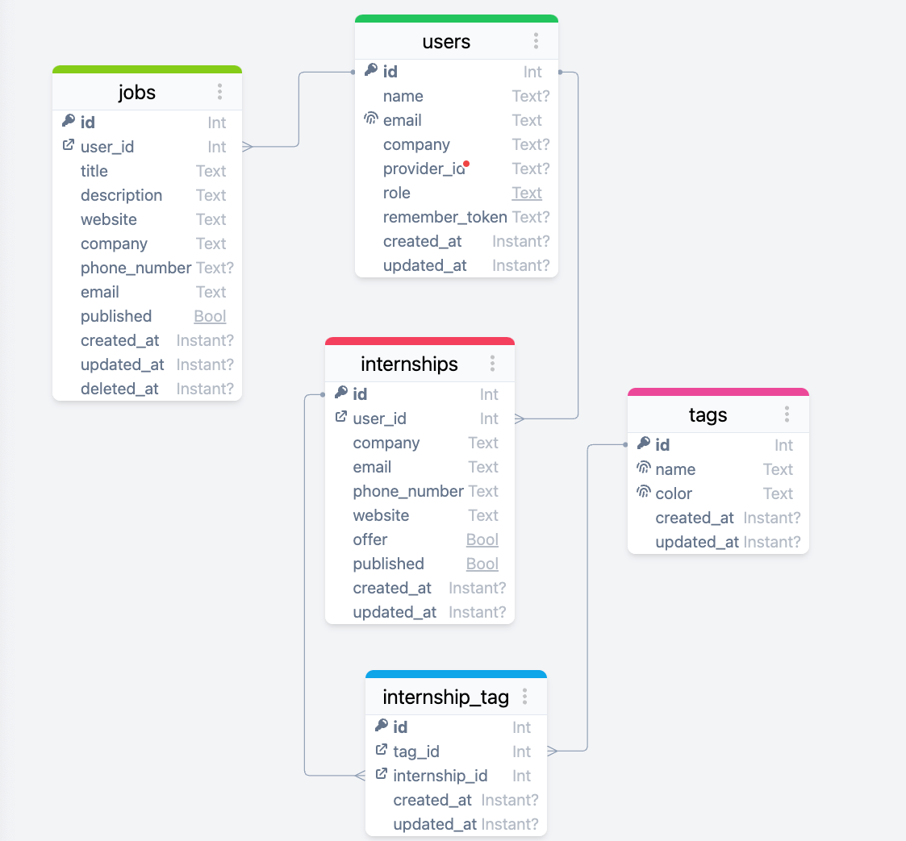

<h1 align="center">Stagebedrijven website</h1>

## ℹ️ Info

Momenteel is het vrij moeilijk voor studenten om een overzicht te krijgen van alle bedrijven die op zoek zijn naar 
stagiairs. De bedoeling is om een simpel, maar overzichtelijk platform te bouwen waar bedrijven zich kunnen aanmelden. 
Tijdens de aanmelding kunnen ze duidelijk aangeven in welke sector ze werken en naar welke skillsets ze op zoek zijn.

Studenten kunnen op het platform filteren op hun skills (Front-end, Back-end, UX/UI, …) en krijgen dan de beschikbare 
stageplekken te zien. Bij het klikken op een stageplek krijg je al een kleine omschrijving van je 
mogelijke opdrachten/verantwoordelijkheden tijdens je stage.

Ten slotte moet er ook een duidelijk overzicht zijn van de contactgegevens, om het sollicitatiegesprek zo vlot mogelijk 
te laten verlopen.

## 🔗 Links
- **[Figma](https://www.figma.com/files/project/110303495/Stagebedrijven-site?fuid=1185143655152052833)**
- **[Miro](https://miro.com/app/board/uXjVNeB1xm0=/?share_link_id=404024392)**
- **[Trello](https://trello.com/b/LZTfJ95C/stagebedrijven-site)**
- **[Google Drive](https://drive.google.com/drive/folders/0AHD_Ps4I-Pi6Uk9PVA)**

## 💾 ERD

## ☎️ Contact
@sam-kdg

